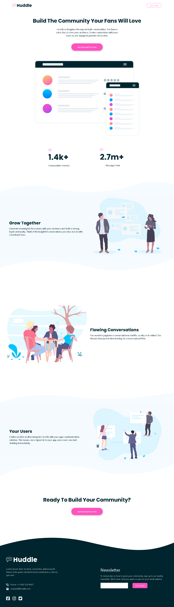

# Frontend Mentor - Huddle landing page with curved sections solution

This is a solution to the [Huddle landing page with curved sections challenge on Frontend Mentor](https://www.frontendmentor.io/challenges/huddle-landing-page-with-curved-sections-5ca5ecd01e82137ec91a50f2). Frontend Mentor challenges help you improve your coding skills by building realistic projects. 

## Table of contents

- [Overview](#overview)
  - [The challenge](#the-challenge)
  - [Screenshot](#screenshot)
  - [Links](#links)
- [My process](#my-process)
  - [Built with](#built-with)
  - [What I learned](#what-i-learned)
  - [Continued development](#continued-development)
  - [Useful resources](#useful-resources)
- [Author](#author)
- [Acknowledgments](#acknowledgments)

**Note: Delete this note and update the table of contents based on what sections you keep.**

## Overview

This project was built with the aid of boostrap frame work which helped for faster development and responsive design

### The challenge

Users should be able to:

- View the optimal layout for the site depending on their device's screen size
- See hover states for all interactive elements on the page

### Screenshot

### Links

- Solution URL: [Add solution URL here](https://your-solution-url.com)
- Live Site URL: [Add live site URL here](https://your-live-site-url.com)

## My process

### Built with

- Semantic HTML5 markup
- CSS custom properties
- Flexbox
- Bootstrap

### What I learned

This project thought me how to effectively use bootstrap for smooth responsive design. I also learnt how to add complex background to a section.

### Continued development

To build more beautiful interphases, i have decided to go more in depth into css by learning more about bootstrap and tailwind css. Then will move on to learn react and vue frameworks.

### Useful resources

- [web.dev](https://web.dev/learn/css/backgrounds) - This article helped me to understand how to use background. You can check it out if you want to understand more about background

## Author

- Frontend Mentor - [@Jerryhugo](https://www.frontendmentor.io/profile/jerryhugo)
- Twitter - [Sage.dev](https://www.twitter.com/insp_family)

## Acknowledgments

I want to use this medium to appreciate frontend mentor for creating such challenges and resources to help foster the learning of frontend development.

